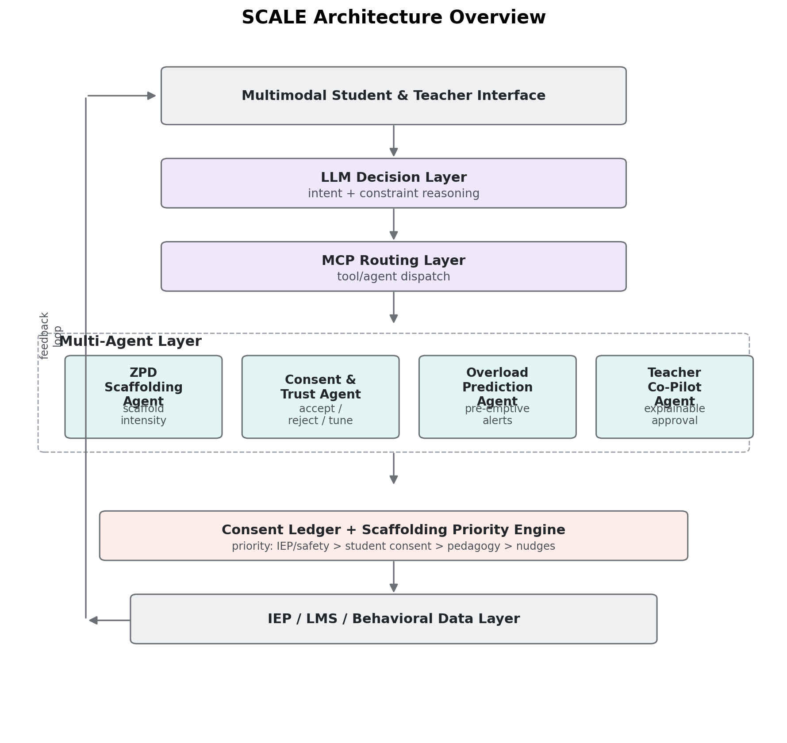
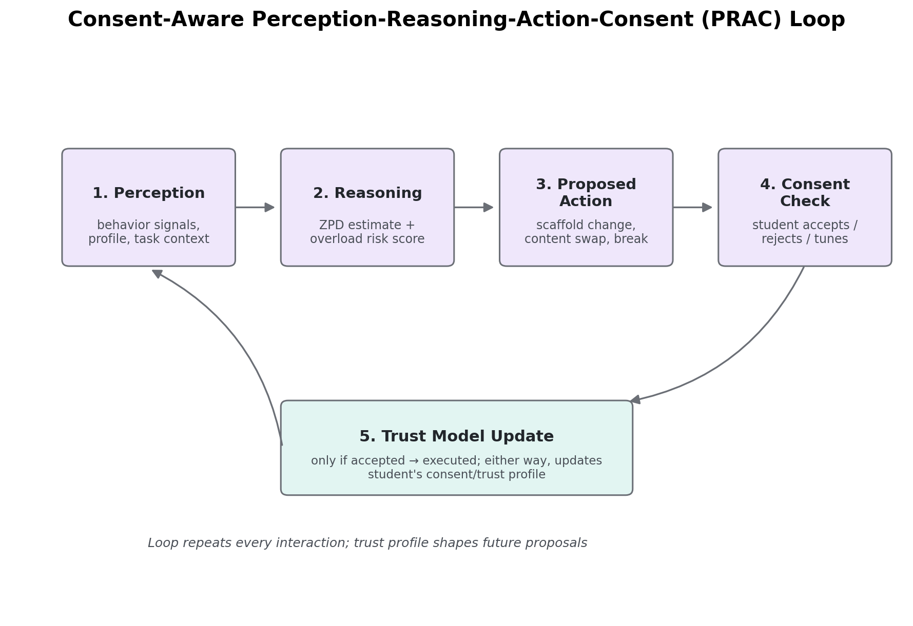

# SCALE Architecture

This document describes how SCALE is structured and why, with the actual diagrams used
in the accompanying paper. For setup and usage, see the main [README](README.md).

## The problem this addresses

Real data from the Open University Learning Analytics Dataset (OULAD, 32,593 students)
shows a measurable gap for disabled learners: a 38.1% vs. 48.2% pass/distinction rate, a
39.3% vs. 30.3% withdrawal rate, and materially lower platform engagement (1,327 vs. 1,539
mean clicks). SCALE is designed against this real, documented gap — not a hypothetical one.

## Design principles

SCALE is organized around three ideas that are new relative to prior multi-agent assistive
systems (most notably ADAPT, a health-domain agentic framework this project is architecturally
inspired by):

1. **Consent-first adaptation** — the system proposes changes and the student can accept,
   reject, or implicitly shape future proposals through a trust profile. Nothing is forced.
2. **Zone of Proximal Development (ZPD)-based scaffolding** — instead of adjusting a single
   difficulty number, the system reasons about *scaffolding depth*: independent work, a
   partial hint, or a full worked example.
3. **Proactive, not reactive, risk prediction** — the Overload Prediction Agent forecasts
   sensory/cognitive overload one session *ahead of time*, using only past behavioral trends,
   and triggers a preemptive break — rather than detecting a problem only after it happens.

## System architecture

Five layers: a multimodal interface, an LLM-based decision layer for intent parsing, a
Model Context Protocol (MCP) routing layer, the four specialized agents, and a Consent
Ledger that reconciles agent outputs before anything reaches the student or teacher.

**Layer-by-layer:**

| Layer | Role |
|---|---|
| Interface | Multimodal input/output (voice, text, touch) |
| LLM Decision Layer | Parses free-text/voice intent *(designed, not implemented — see note below)* |
| MCP Routing | Dispatches parsed intent to the correct agent(s) |
| Multi-Agent Layer | The four agents described below, each running independently |
| Consent Ledger | Enforces priority: safety/IEP compliance > student consent > pedagogy > nudges |

> **Implementation note:** the LLM Decision Layer is architecturally specified but not built
> in this repository. The four agents communicate via direct function calls on structured,
> numeric data (mastery scores, error rates, timestamps) and do not require an LLM to function.
> See the main README's "Architecture vs. implementation" section for the full explanation.

## The four agents

### 1. ZPD Scaffolding Agent
Tabular **Q-learning** over a 45-state space (mastery level × fatigue level × recent error
rate), choosing between three actions: independent work, a partial hint, or a full worked
example. Learns purely from trial-and-error interaction with the simulated environment —
it never has access to the "correct" scaffold level, only behavioral feedback.

### 2. Consent & Trust Agent
Every scaffold change proposed by the ZPD agent is gated through this agent before
execution. Acceptance probability depends on current trust and how large the proposed
change is; rejecting a suggestion still updates trust (respecting a "no" is informative,
not wasted). If rejected, the system falls back to the student's current level rather than
forcing the change.

### 3. Overload Prediction Agent
A RandomForest classifier trained to forecast overload **one session ahead**, using only
the trend of behavioral signals (response latency, error rate, hesitation, fatigue) from
the two preceding sessions — never the current session's own data. This is a genuinely
harder task than detecting an anomaly after it's already visible, and is evaluated as such.

### 4. Teacher Co-Pilot Agent
Generates a plain-language, data-grounded rationale for every decision, and flags students
whose trust, acceptance rate, or overload trend suggests they need teacher attention. Flags
are checked against actual outcomes to confirm they're informative, not just noise.

## The Consent-Aware PRAC loop

Each agent runs an extended Perception-Reasoning-Action loop with an added **Consent**
stage — the core mechanism that distinguishes SCALE's coordination model from a plain
Perception-Reasoning-Action loop.

No action executes on the student without either explicit consent or a pre-authorized
safety override. Every outcome — accepted or rejected — updates the trust model, which
shapes how future proposals are made.

## Results at a glance

Full experimental methodology and figures are in [RESULTS.md](RESULTS.md).
