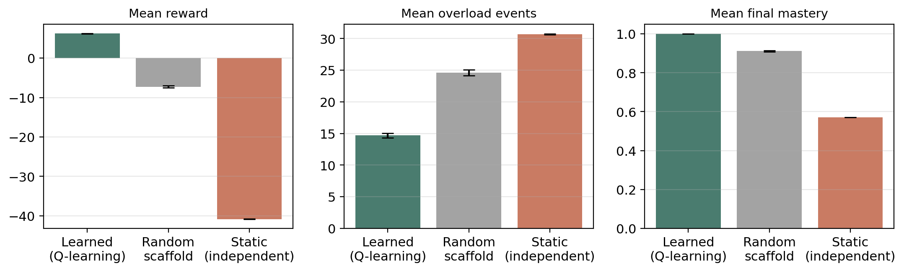
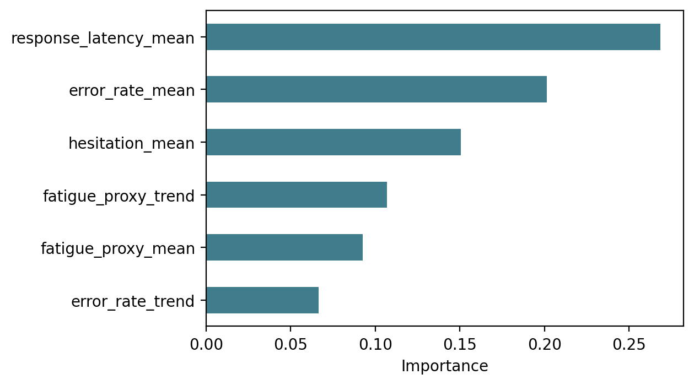
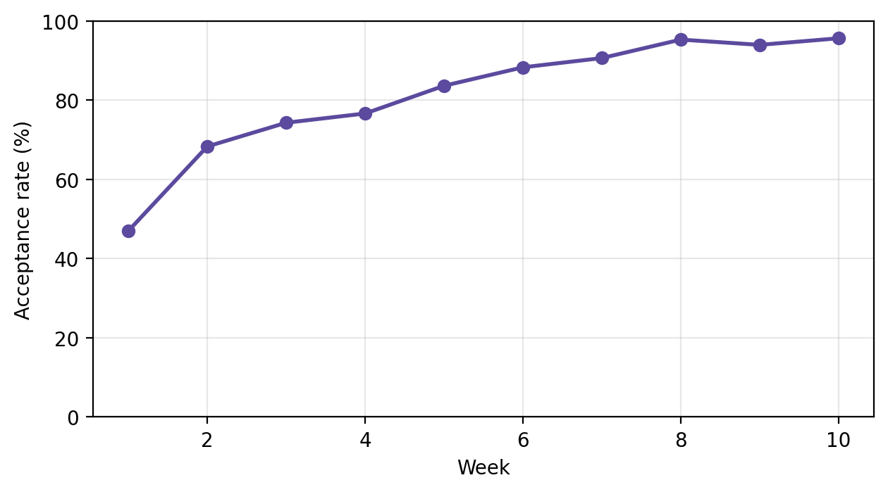
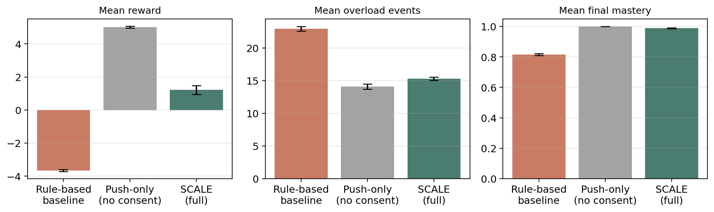
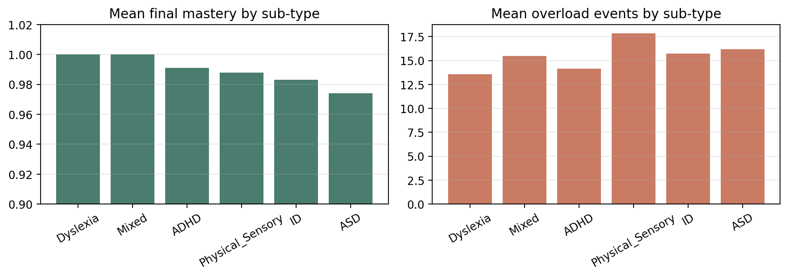
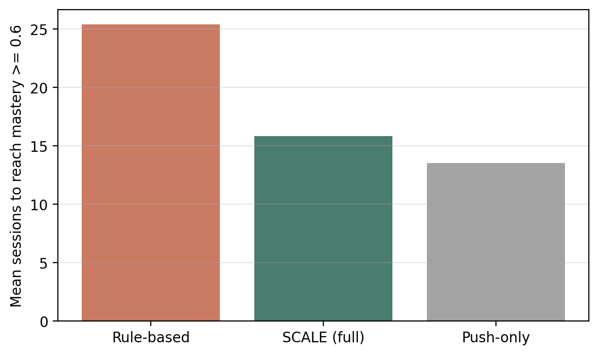
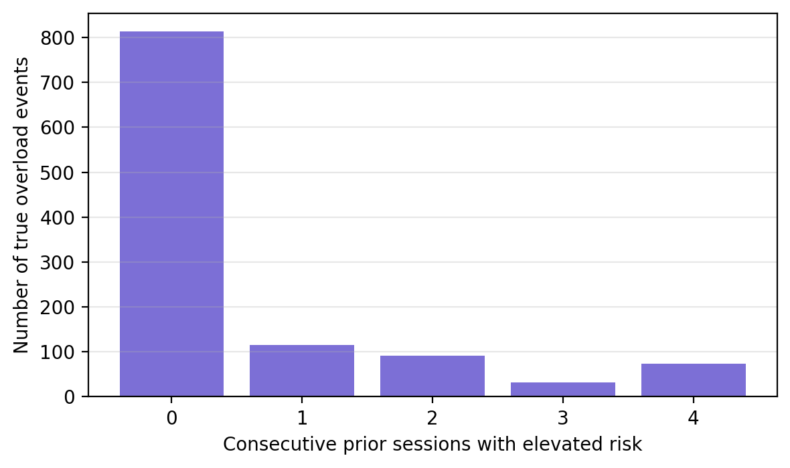

# SCALE Results

Full experimental results, all reproducible from the code in `src/`. See
[ARCHITECTURE.md](ARCHITECTURE.md) for how the system is designed.

## Methodology summary

- **Population:** 400 synthetic students across six disability sub-types (ASD, ADHD,
  dyslexia, intellectual disability, physical/sensory, mixed), calibrated so the
  population's overall performance/engagement disadvantage matches real ratios computed
  from OULAD (a real dataset of 32,593 students).
- **Split:** 320 students for training, 80 fully held-out students for evaluation —
  no agent is ever evaluated on data it influenced during training.
- **Repetition:** every experiment is run across multiple random seeds (5 for individual
  agents, 3 for full-system integration) and reported as mean ± standard deviation, not a
  single run.
- **Simulation:** each student is simulated over a 10-week, 5-session-per-week closed loop
  where agent decisions causally affect mastery, error rate, fatigue, and overload risk.

## 1. ZPD Scaffolding Agent vs. baselines

| Policy | Mean reward | Mean overload events | Mean final mastery |
|---|---|---|---|
| **Learned (Q-learning)** | **6.23 ± 0.03** | **14.70 ± 0.36** | **1.000 ± 0.000** |
| Random scaffold | -7.24 ± 0.30 | 24.63 ± 0.47 | 0.912 ± 0.003 |
| Static (always independent) | -40.82 ± 0.02 | 30.67 ± 0.07 | 0.570 ± 0.000 |

The gap between the learned policy and both baselines is an order of magnitude larger
than seed-to-seed variance — the advantage is not a lucky random draw.

## 2. Overload Prediction Agent

Forecasting overload **one session ahead**, using only behavioral trends from the two
preceding sessions (a genuinely harder task than reactive, after-the-fact detection):

| Metric | Value |
|---|---|
| Accuracy | 0.614 |
| Precision | 0.514 |
| Recall | 0.595 |
| F1 | 0.552 |
| ROC-AUC | 0.649 |

Response latency and error-rate trend dominate feature importance, consistent with the
environment's underlying causal structure. This is reported as a modest but genuine
early-warning signal, not an inflated claim.

## 3. Consent & Trust Agent

Gating scaffold changes through explicit consent costs some short-term reward relative to
a push-only control, because rejected proposals sometimes forgo an objectively better
action. But acceptance climbs sharply over the simulated term:

**Week 1: 47.0% acceptance → Week 10: 95.7% acceptance** (final mean trust: 0.972). This is
the core evidence that treating consent as a first-class mechanism — not an afterthought —
produces a measurable, positive trust dynamic over time.

## 4. Teacher Co-Pilot Agent

Every decision receives a template-grounded rationale (100% coverage by construction — this
measures rationale coverage, not human-judged understandability, which would require a real
user study). Of 80 held-out students, 43.8% were flagged for teacher attention. Flagged
students showed substantially worse outcomes (mean overload events 21.26 vs. 12.31; mean
final mastery 0.952 vs. 1.000) — confirming the flags are informative, not arbitrary.

## 5. Full-system integration (headline result)

Three conditions compared across 3 random seeds on held-out students: the complete
four-agent SCALE system, a non-agentic rule-based baseline (heuristic scaffold rule, no
consent, no proactive breaks), and a push-only control (SCALE's agents without the consent
gate).

| Condition | Mean reward | Mean overload events | Mean final mastery | Acceptance rate |
|---|---|---|---|---|
| **SCALE (full)** | 1.22 ± 0.27 | 15.28 ± 0.25 | 0.989 ± 0.003 | 72.9% ± 0.6% |
| Rule-based baseline | -3.65 ± 0.06 | 22.94 ± 0.35 | 0.816 ± 0.007 | n/a (auto-execute) |
| Push-only (no consent) | 5.02 ± 0.06 | 14.12 ± 0.40 | 1.000 ± 0.000 | n/a (auto-execute) |

**Interpretation:** SCALE clearly beats the non-agentic rule-based baseline on every metric.
Against the push-only control, SCALE trades some reward for genuinely consent-gated
behavior rather than forced execution — a real, honestly-reported cost, not smoothed over.

## 6. Statistical significance

Paired t-test comparing SCALE (full) against the rule-based baseline, matched by
(student, random seed) — 240 paired observations:

| Metric | SCALE mean | Rule-based mean | Mean difference | p-value |
|---|---|---|---|---|
| Total reward | 1.220 | -3.654 | +4.874 | 3.37e-34 |
| Overload events | 15.279 | 22.938 | -7.658 | 1.71e-53 |
| Final mastery | 0.989 | 0.816 | +0.173 | 3.05e-40 |

All differences are significant well beyond p < 0.001 — the improvement is not
attributable to random chance.

## 7. Fairness across disability sub-types

Mastery spread across the six disability sub-types is only **0.026** (0.974–1.000) —
SCALE is fairly equitable in final learning outcome across sub-types. Overload burden
varies more: ASD and Physical/Sensory sub-types (which have higher baked-in sensory
sensitivity in the synthetic population) see somewhat more overload events on average.
This is reported honestly rather than only showing the favorable average.

## 8. Learning efficiency

Average sessions needed to first reach mastery ≥ 0.6:

| Condition | Mean sessions to mastery |
|---|---|
| Push-only (no consent) | 13.50 |
| SCALE (full) | 15.82 |
| Rule-based baseline | 25.38 |

SCALE reaches meaningful mastery roughly **38% faster** than the non-agentic rule-based
baseline, while push-only is fastest of all — the cost of never asking the student.

## 9. Overload prediction lead time

For 1,126 real overload events in the held-out evaluation, measuring how many
consecutive prior sessions already showed elevated risk (≥0.5):

- Mean: **0.61** sessions of sustained prior warning
- **72.2%** of events have no sustained prior warning (caught only at the event itself)
- **27.8%** of events get at least 1 session of advance warning

This is reported as a modest, honest result: proactive forecasting from behavioral
trends alone is a genuinely hard problem, and this is the ceiling for this feature set
without richer signals (e.g., physiological data).

## Limitations

All results above are simulation-based algorithmic comparisons, not evidence of real-world
educational effectiveness. See the main [README](../README.md#limitations) for the full list.
